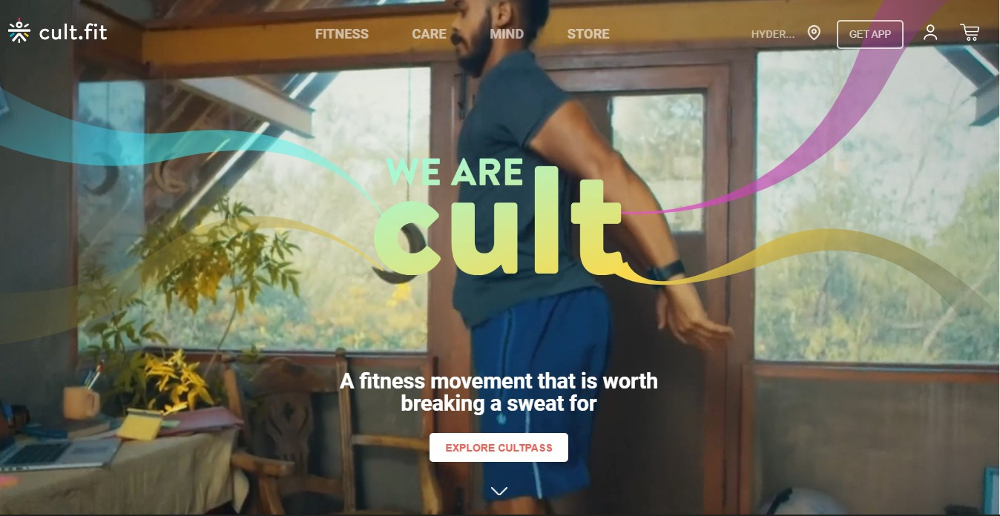
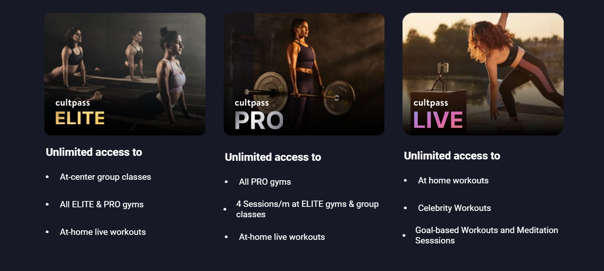
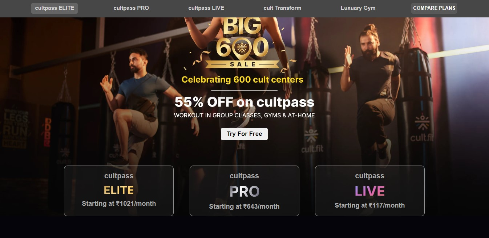
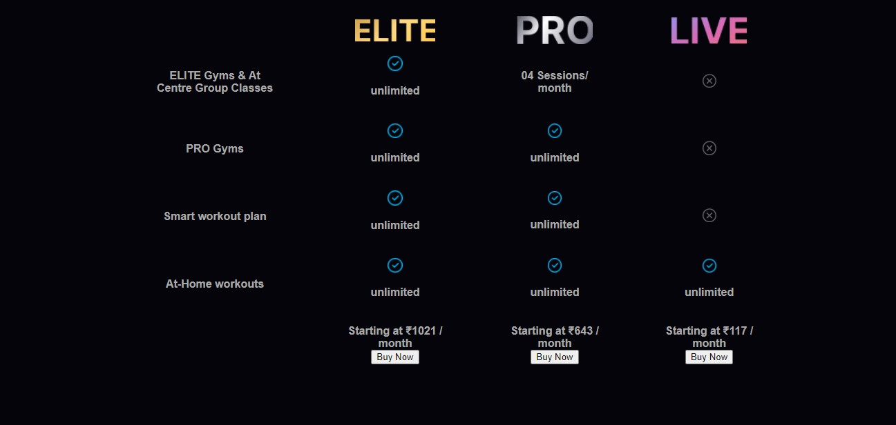
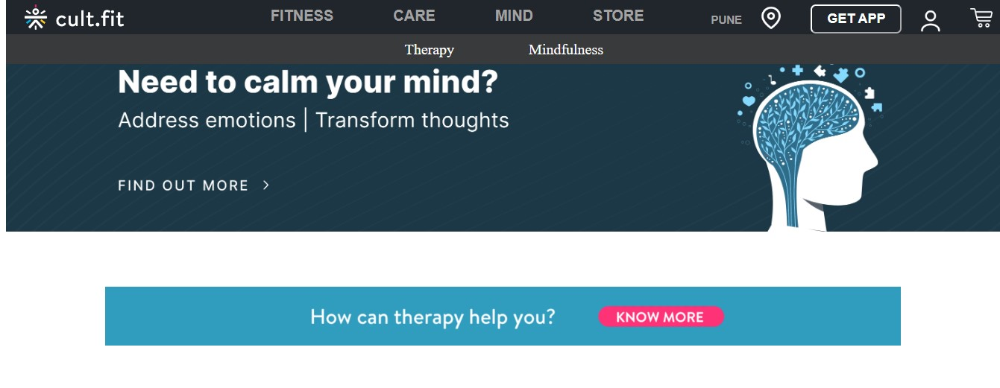
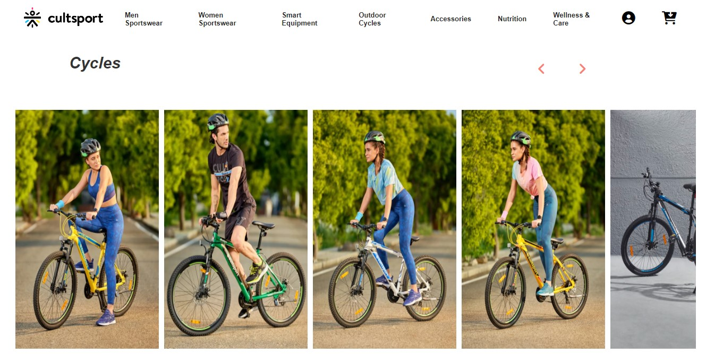

# Cult Fit Clone

### This is a construct week project where I had to clone the Cultfit.com website within a duration of 5 days. I have tried to clone as much functionality as I have learned till yet.

## About Website :

Cultfit.com is a fitness-based website with a lot of services like yoga videos, training sessions, and an e-commerce store where one can purchase a variety of fitness types of equipment and products.

## Tech Stack :

- HTML
- CSS
- JavaScript
- ES6

## Tools :

- Local Storage

## Features :

- Login/signup functionality
- Add to cart
- Static pages and a good User Interface

## Landing Page

## Fitness Page

## Mind Page

## Care Page

## Store Page

# 
